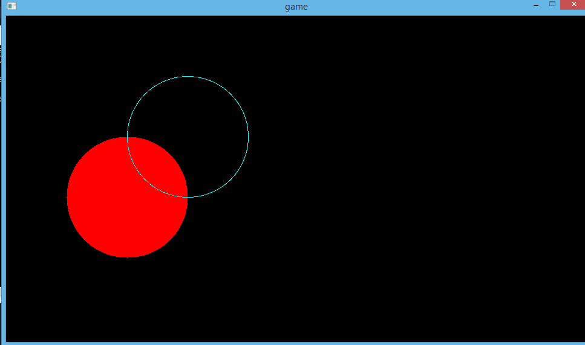

# lib for rendering circle in sdl.v

## Render circle

```v
	sdl.set_render_draw_color(ren, 0, 0, 0, 255)
	sdl.render_clear(ren)

	cfx.fill_circle(ren, 200, 300, 100, 0xff0000ff)
	cfx.draw_circle(ren, 300, 200, 100, 0x00ffffff)

	sdl.render_present(ren)

	sdl.delay(1000/60)
```

---

---

